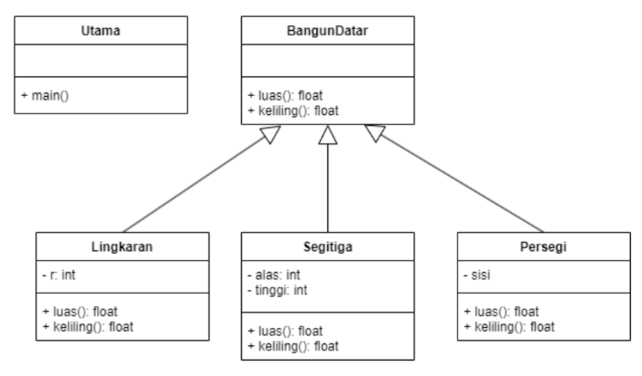
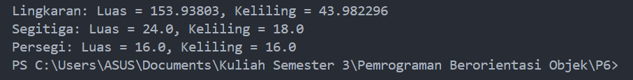

# Polimorfisme
## Praktikum Pertemuan Ke 6 Pemrograman Orientasi Objek.


## Latihan
Implementasikan
java code diagram
class berikut :



<br> <br>


<b>1. BangunDatar.java (Kelas Abstrak)</b>

``` java
public abstract class BangunDatar {
    // Metode abstrak untuk menghitung luas dan keliling
    public abstract float luas();
    public abstract float keliling();
}
```

Ini adalah kelas abstrak bernama ```BangunDatar```, yang mewakili bentuk-bentuk geometri 2D (misalnya, lingkaran, segitiga, persegi). <br>
Kelas ini memiliki dua metode abstrak : <br>
```luas()``` (untuk menghitung luas) <br>
```keliling()``` (untuk menghitung keliling). <br>

Metode abstrak dideklarasikan tanpa implementasi di sini. Metode ini akan ditimpa (override) oleh kelas yang mewarisi ```BangunDatar```. Artinya, setiap bentuk (misalnya, ```Lingkaran```, ```Segitiga```, ```Persegi```) akan mendefinisikan logika mereka sendiri untuk menghitung luas dan keliling. <br> <br> <br>


<b>2. Lingkaran.java (Kelas Lingkaran) </b>

``` java
public class Lingkaran extends BangunDatar {
    private int r;

    // Konstruktor
    public Lingkaran(int r) {
        this.r = r;
    }

    // Implementasi penghitungan luas
    @Override
    public float luas() {
        return (float) (Math.PI * r * r);
    }

    // Implementasi penghitungan keliling
    @Override
    public float keliling() {
        return (float) (2 * Math.PI * r);
    }
}
```

Kelas ini mewarisi (extends) kelas ```BangunDatar```, artinya kelas ini mewarisi struktur dan harus mengimplementasikan metode ```luas()``` dan ```keliling()```. <br>

Atribut : <br>
```r``` mewakili jari-jari lingkaran. <br>

Konstruktor : <br>
Konstruktor menerima ```r``` (jari-jari) sebagai parameter saat membuat objek ```Lingkaran```. <br>

Metode : <br>
```luas()``` menghitung luas dengan rumus : 𝜋 × 𝑟2.
```keliling()``` menghitung keliling dengan rumus : 2 × π × r. <br> <br> <br>


<b>3. Segitiga.java (Kelas Segitiga)</b>

``` java
public class Segitiga extends BangunDatar {
    private int alas;
    private int tinggi;

    // Konstruktor
    public Segitiga(int alas, int tinggi) {
        this.alas = alas;
        this.tinggi = tinggi;
    }

    // Implementasi penghitungan luas
    @Override
    public float luas() {
        return (alas * tinggi) / 2.0f;
    }

    // Implementasi penghitungan keliling (Asumsi segitiga sama sisi)
    @Override
    public float keliling() {
        return 3 * alas;
    }
}
```

Kelas ```Segitiga``` mewarisi ```BangunDatar``` dan mengimplementasikan metode penghitungan luas dan keliling untuk segitiga. <br>

Atribut : <br>
```alas``` : alas segitiga.
```tinggi``` : tinggi segitiga.

Konstruktor : <br>
Konstruktor menerima ```alas``` dan ```tinggi``` sebagai parameter untuk membuat segitiga.

Metode : <br>
```luas()``` menghitung luas dengan rumus segitiga: <b>alas × tinggi</b>. <br>
```keliling()``` menghitung keliling, diasumsikan sebagai segitiga sama sisi (dimana semua sisi sama panjang), sehingga kelilingnya adalah 
<b>3 × alas</b>. Jika jenis segitiga yang dimaksud berbeda, rumus ini perlu disesuaikan. <br> <br> <br>


<b>4. Persegi.java (Kelas Persegi)</b>

``` java
public class Persegi extends BangunDatar {
    private int sisi;

    // Konstruktor
    public Persegi(int sisi) {
        this.sisi = sisi;
    }

    // Implementasi penghitungan luas
    @Override
    public float luas() {
        return sisi * sisi;
    }

    // Implementasi penghitungan keliling
    @Override
    public float keliling() {
        return 4 * sisi;
    }
}
```

Kelas ```Persegi``` mewarisi ```BangunDatar``` dan mewakili bentuk persegi. <br>

Atribut : <br>
```sisi``` : panjang sisi persegi.

Konstruktor : <br>
Menerima ```sisi``` sebagai parameter saat membuat persegi.

Metode : <br>
```luas()``` menghitung luas dengan rumus : <b>Area = sisi2</b>. <br>
```keliling()``` menghitung keliling dengan rumus : <b>4 × sisi</b>. <br> <br> <br>


<b>5. Utama.java (Kelas Utama)</b>

``` java
public class Utama {
    public static void main(String[] args) {
        // Membuat objek dari kelas Lingkaran, Segitiga, dan Persegi
        Lingkaran lingkaran = new Lingkaran(7);
        Segitiga segitiga = new Segitiga(6, 8);
        Persegi persegi = new Persegi(4);

        // Menampilkan luas dan keliling dari setiap objek
        System.out.println("Lingkaran: Luas = " + lingkaran.luas() + ", Keliling = " + lingkaran.keliling());
        System.out.println("Segitiga: Luas = " + segitiga.luas() + ", Keliling = " + segitiga.keliling());
        System.out.println("Persegi: Luas = " + persegi.luas() + ", Keliling = " + persegi.keliling());
    }
}
```

Ini adalah kelas Utama yang berisi metode ```main()```, yaitu titik awal program dieksekusi. <br>

Objek : <br>
Membuat instance dari kelas ```Lingkaran```, ```Segitiga```, dan ```Persegi```, dengan parameter seperti jari-jari (untuk ```Lingkaran```), alas dan tinggi (untuk ```Segitiga```), serta panjang sisi (untuk ```Persegi```). <br>

Output : <br>
Untuk setiap objek, metode ```luas()``` dan ```keliling()``` dipanggil, dan hasilnya (luas dan keliling) ditampilkan. <br> <br> <br>


<b>Output akan menampilkan luas dan keliling dari setiap bentuk seperti berikut : <br>



<br> <br>

### Penjelasan Ringkas
Implementasi Java ini menunjukkan konsep pemrograman berorientasi objek seperti abstraksi (menggunakan kelas abstrak), pewarisan (dengan bentuk-bentuk seperti ```Lingkaran```, ```Segitiga```, dan ```Persegi``` mewarisi dari ```BangunDatar```), dan <b>polimorfisme</b> (implementasi berbeda dari metode ```luas()``` dan ```keliling()``` di setiap subclass).


